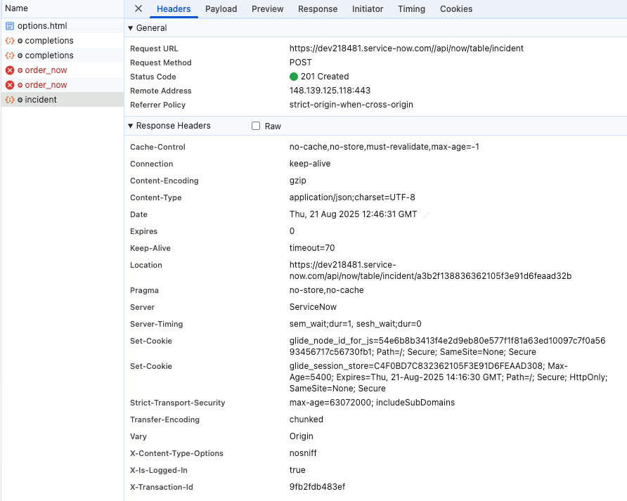
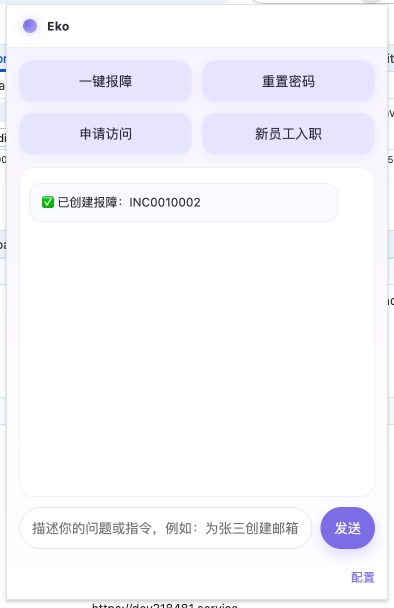
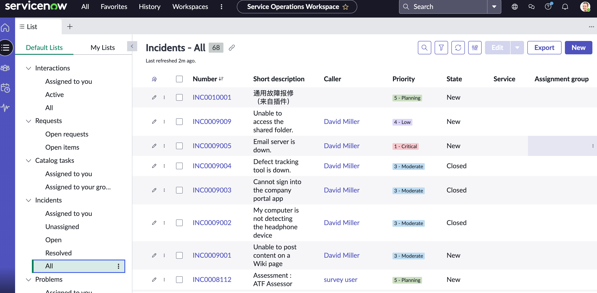
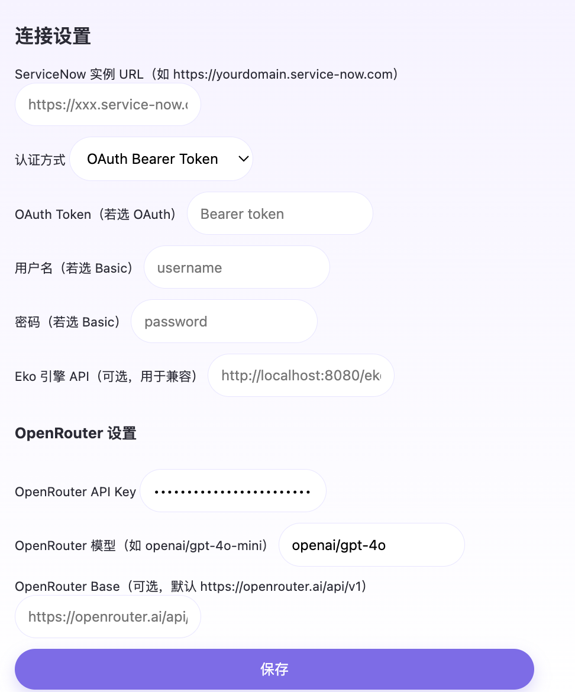

# ServiceNow + Eko 浏览器插件

对话式操作助手：通过 Eko 引擎理解用户意图，按需调用 ServiceNow 常用 API（报障、目录项下单、知识库搜索、变更创建），并把执行结果回传给用户。

## 目录
- 架构概览
  - 运行时架构
  - 消息与数据流
- 代码结构
  - 结构树
  - 主要文件说明
- Eko API 使用说明
  - Endpoint 与权限
  - 请求格式
  - 响应格式与工具调用
- ServiceNow API 使用说明
  - 认证方式
  - 接口汇总
  - 示例
- 安装与配置
  - 加载扩展
  - 选项配置
  - 打包说明（servicenow-bundle.js）
  - 权限说明
- 常见问题
- 安全与合规建议

## 架构概览

### 运行时架构
- Popup（前端 UI）：收集用户输入，并发送消息给 Background。
- Background（Service Worker）：接收消息，协调 Eko API 与 ServiceNow API 调用，返回结果给 Popup。
- Eko 引擎：根据用户自然语言与工具 Schema 决策是否调用某个“工具”（ServiceNow API）。
- ServiceNow：提供工单、目录项、知识库、变更等 REST 接口。



### 消息与数据流
1. 用户在 Popup 输入问题或点击快捷按钮。
2. Popup 发送 `chrome.runtime.sendMessage` 到 Background。
3. 对话类型（EKO_CHAT）时，Background：
   - 从 `chrome.storage.sync` 读取 `ekoUrl`；
   - POST 请求到 Eko，引擎收到工具清单 `tools`；
   - 若 Eko 返回 `toolCalls`，Background 逐个调用 ServiceNow API，并回填 `toolResults`。
4. Background 将回复与结果返回给 Popup，UI 展示。

## 代码结构

### 结构树
erviceNowPlugin/
├─ manifest.json # MV3 清单
├─ background.js # Service Worker（消息路由、Eko/ServiceNow 协调）
├─ popup.html # 弹窗 UI
├─ popup.js # 弹窗逻辑（聊天、快捷场景按钮）
├─ options.html # 配置页面 UI
├─ options.js # 保存 ServiceNow/Eko 配置到 storage
├─ styles.css # 统一样式
├─ servicenow.js # ServiceNow API 封装（需打包为 servicenow-bundle.js）
├─ icons/
│ ├─ icon16.png
│ ├─ icon32.png
│ └─ icon128.png

### 主要文件说明
- `manifest.json`：声明 `default_popup`、`options_ui`、`background.service_worker`、`permissions`、`host_permissions`。
- `background.js`：
  - 通过 `importScripts('servicenow-bundle.js')` 注入 `createIncident`、`orderCatalogItem`、`searchKnowledge`、`createChange` 到 `self`。
  - 处理消息类型：
    - `EKO_CHAT`：对话到 Eko，引擎如返回 `toolCalls` 则执行相应 ServiceNow API。
    - `QA_INCIDENT | QA_RESET | QA_ACCESS | QA_ONBOARD`：一键触发常见场景。
- `servicenow.js`：
  - `snowFetch(path, method, body)`：统一认证与请求封装（OAuth Bearer / Basic）。
  - 封装方法：`createIncident`、`orderCatalogItem`、`searchKnowledge`、`createChange`。
- `popup.js`：发送 `EKO_CHAT`，并提供四个快捷按钮。
- `options.js`：保存配置到 `chrome.storage.sync`：`snowUrl`, `authType`, `oauthToken`, `username`, `password`, `ekoUrl`。



## Eko API 使用说明

### Endpoint 与权限
- 在 Options 页配置：`Eko 引擎 API`（如 `http://localhost:8080/eko/run`）。
- `manifest.json` 已允许：`"host_permissions": ["http://localhost/*","https://*/eko/*"]`。

### 请求格式（Background → Eko）
```json
{
  "query": "为张三创建邮箱访问工单",
  "tools": [
    { "name":"createIncident","description":"创建报障工单","args":["short_description","description","urgency","impact","category"] },
    { "name":"orderCatalogItem","description":"下单目录项（密码重置/权限申请/入职）","args":["itemSysId","variables"] },
    { "name":"searchKnowledge","description":"搜索知识库","args":["query","limit"] },
    { "name":"createChange","description":"创建变更请求","args":["short_description","description","type"] }
  ],
  "mode": "tool-calls-via-extension"
}
```

### 响应与工具调用（Eko → Background）
Eko 响应示例：
```json
{
  "reply": "正在为张三申请邮箱访问权限。",
  "toolCalls": [
    {
      "id": "call_1",
      "name": "orderCatalogItem",
      "args": { "itemSysId":"<ACCESS_SYS_ID>", "variables":{"system":"Email","role":"read"} }
    }
  ]
}
```
Background 执行后回填：
```json
{
  "reply": "已创建访问申请。",
  "toolCalls": [...],
  "toolResults": [
    { "id":"call_1", "output": { "result": { "request_id":"RITM0012345" } } }
  ]
}
```

## ServiceNow API 使用说明



### 认证方式（Options 可选）
- OAuth Bearer（推荐生产）
- Basic（仅测试/低风险环境）

### 接口汇总
- Incident（创建报障）
  - POST `/api/now/table/incident`
- Catalog（目录项下单：密码重置/访问申请/入职等）
  - POST `/api/sn_sc/servicecatalog/items/{itemSysId}/order_now`
- Knowledge（知识库搜索）
  - GET `/api/now/table/kb_knowledge?sysparm_query=...&sysparm_limit=...`
- Change（创建变更）
  - POST `/api/now/table/change_request`

### 示例（cURL）
创建报障：
```bash
curl -X POST "$SNOW/api/now/table/incident" \
  -H "Authorization: Bearer $TOKEN" -H "Content-Type: application/json" \
  -d '{"short_description":"通用故障报修（来自插件）","description":"用户在插件中发起报障，请 IT 跟进","urgency":"3","impact":"3","category":"inquiry"}'
```

目录项下单：
```bash
curl -X POST "$SNOW/api/sn_sc/servicecatalog/items/$ITEM_SYS_ID/order_now" \
  -H "Authorization: Bearer $TOKEN" -H "Content-Type: application/json" \
  -d '{ "variables": { "user":"me" } }'
```

知识库搜索（简化）：
```bash
curl "$SNOW/api/now/table/kb_knowledge?sysparm_query=short_descriptionLIKEVPN^ORtextLIKEVPN&sysparm_limit=5" \
  -H "Authorization: Bearer $TOKEN"
```

## 安装与配置

### 加载扩展
1. Chrome → 扩展程序 → 开发者模式。
2. “加载已解压的扩展程序”，指向 `serviceNowPlugin/`。

### 选项配置
- `ServiceNow 实例 URL`（例 `https://yourdomain.service-now.com`）
- `认证方式`：OAuth 或 Basic
- `OAuth Token` 或 `用户名/密码`
- `Eko 引擎 API`（例 `http://localhost:8080/eko/run`）
- 保存后写入：`snowUrl`, `authType`, `oauthToken`, `username`, `password`, `ekoUrl`



### 打包说明（servicenow-bundle.js）
- `background.js` 通过 `importScripts('servicenow-bundle.js')` 注入 API。
- 将 `servicenow.js` 打包为 IIFE（示例：esbuild）：
```bash
esbuild servicenow.js --bundle --format=iife --global-name=ServiceNowAPI --outfile=servicenow-bundle.js --minify
# 产物末尾追加：
# self.createIncident    = ServiceNowAPI.createIncident;
# self.orderCatalogItem  = ServiceNowAPI.orderCatalogItem;
# self.searchKnowledge   = ServiceNowAPI.searchKnowledge;
# self.createChange      = ServiceNowAPI.createChange;
```

### 权限说明
`manifest.json`:
- `"permissions": ["storage", "notifications", "alarms"]`
- `"host_permissions": ["*://*.service-now.com/*", "http://localhost/*", "https://*/eko/*"]`

## 常见问题
- 未配置 Eko 地址：Background 抛“未配置 Eko 引擎 API”。
- ServiceNow 认证失败：检查 `authType` 与 Token/用户名密码。
- 目录项失败：核对 `itemSysId` 与 `variables`。
- Eko 未触发工具：检查传入 `tools`、`mode`。

## 安全与合规建议
- 优先使用 OAuth；Basic 仅限测试。
- 不要在日志中输出敏感信息（Token/密码）。
- 企业环境建议统一经网关鉴权/审计。